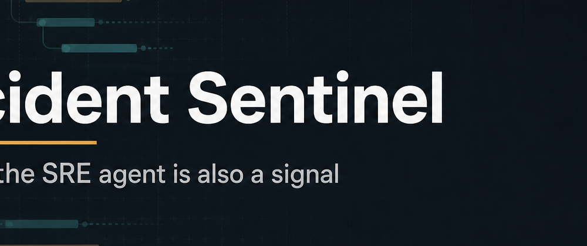
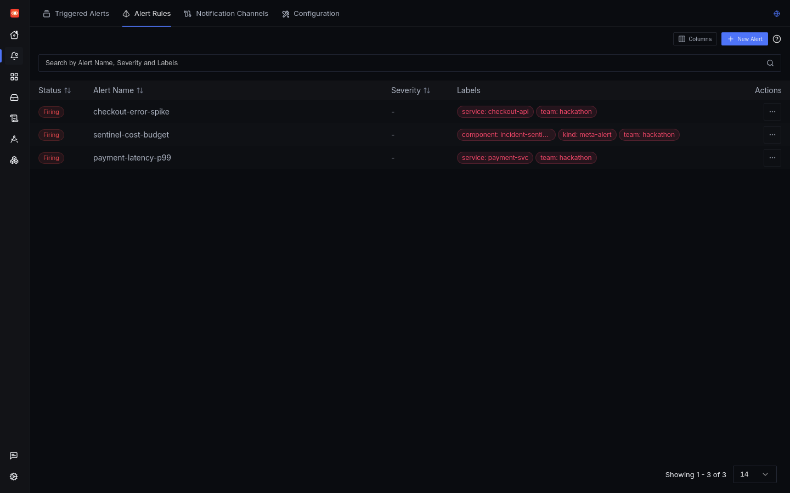
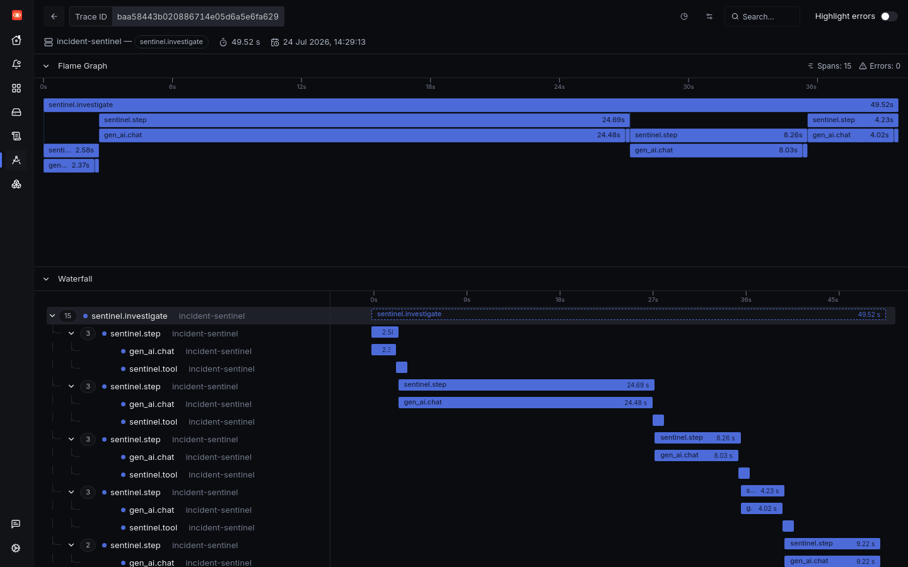
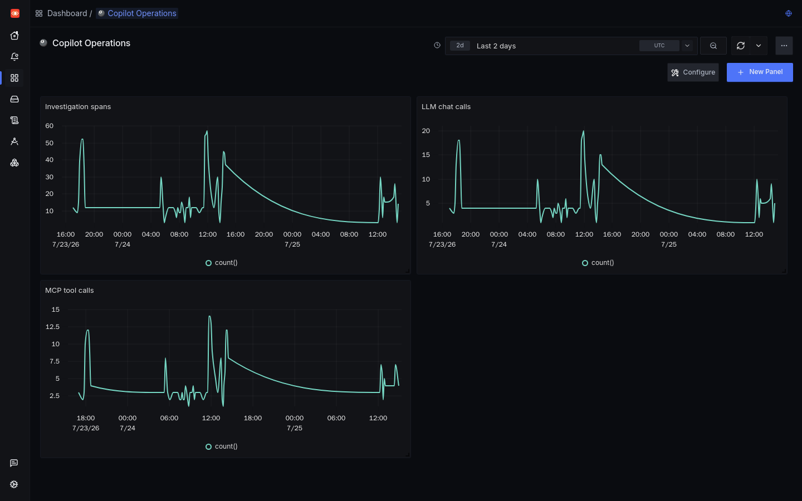
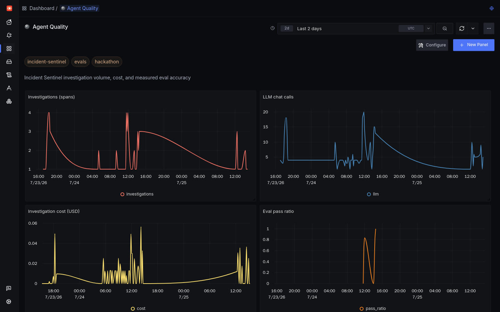
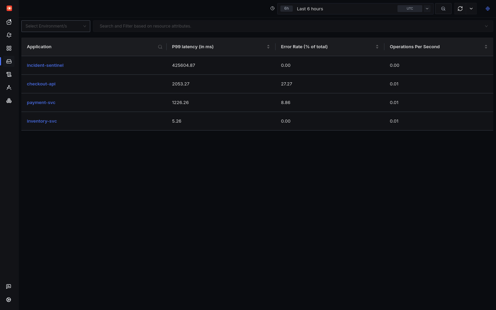

# Incident Sentinel

<p align="center">
  
</p>

**SRE Incident Copilot** for the [Agents of SigNoz](https://www.wemakedevs.org/hackathons/signoz) hackathon  
**Track:** Track 01 — AI & Agent Observability

When a SigNoz alert fires, Incident Sentinel investigates with the **SigNoz MCP server**, posts an evidence-backed report (and postmortem) to Slack, and emits its own OpenTelemetry traces and cost metrics back into the **same** SigNoz — including a meta-alert when the copilot overspends.

Accuracy is **measured** with real fault injection (`evals/`), not claimed.

**Blog:** [dev.to — Incident Sentinel](https://dev.to/vickyavh7/incident-sentinel-an-sre-copilot-that-investigates-signoz-alerts-and-observes-itself-10il)

## Demo video

<!-- Replace VIDEO_ID after YouTube upload (Unlisted is fine) -->
<!--
[](https://www.youtube.com/watch?v=VIDEO_ID)
-->

Paste your Unlisted YouTube link here after upload (≤3 min). Outline: `docs/DEMO-VIDEO.md`.

## Screenshots

| Alerts (incl. cost meta-alert) | Investigation trace |
|---|---|
|  |  |

| Copilot Operations | Agent Quality |
|---|---|
|  |  |

Services during a fault window:



## Architecture

```text
checkout → payment → inventory     (demo apps + fault injection)
        │ OTLP
        ▼
   SigNoz + MCP  (Foundry)
        │ alert webhook / POST /investigate
        ▼
   Incident Sentinel
        ├── MCP tools (traces, logs, metrics, services)
        ├── LLM investigation loop
        ├── Slack report + markdown postmortem
        └── OTLP → same SigNoz (tokens, cost, agent quality)
```

## Features

| Capability | What it does |
|---|---|
| MCP investigation | Tool-calling agent over SigNoz traces / logs / metrics / alerts |
| Cascade-aware blame | Prefers deepest origin in `checkout → payment → inventory` |
| Slack + postmortems | Root cause, timeline, evidence links; `GET /postmortems/{ruleId}` |
| Self-observability | GenAI spans + `sentinel_cost_usd_total` / token metrics in SigNoz |
| Cost meta-alert | `sentinel-cost-budget` — the copilot can page about its own spend |
| Agent Quality dashboard | Investigations, cost, eval pass ratio (`dashboards/agent-quality.json`) |
| Accuracy evals | `evals/run_evals.py` — real faults, scored verdicts → `evals/RESULTS.md` |

## Quick start

### 1. Prerequisites

- Docker (for [SigNoz Foundry](https://signoz.io) + MCP)
- Kubernetes cluster for demo apps + copilot
- LLM API key (OpenAI-compatible; NVIDIA NIM works)
- Optional: Slack incoming webhook

### 2. Foundry SigNoz

This repo includes the required Foundry casting files:

- `foundry/casting.yaml`
- `foundry/casting.yaml.lock`

Follow SigNoz Foundry docs to cast, then enable the MCP server. Register an admin user and create a **Service Account API key** (Admin/Editor).

### 3. Configure

```bash
cp .env.example .env
# Set:
#   SIGNOZ_URL, MCP_URL, OTEL_EXPORTER_OTLP_ENDPOINT
#   SIGNOZ_API_KEY, LLM_API_KEY, SLACK_WEBHOOK_URL (optional)
#   LLM_PROVIDER=openai
#   LLM_MODEL=meta/llama-3.1-70b-instruct   # or your available model
#   LLM_BASE_URL=https://integrate.api.nvidia.com/v1  # if using NVIDIA
```

### 4. Deploy demo + copilot

```bash
export FOUNDRY_HOST=<signoz-host-or-ip>
export LLM_PROVIDER=openai
export LLM_MODEL=meta/llama-3.1-70b-instruct
export LLM_BASE_URL=https://integrate.api.nvidia.com/v1
export LLM_API_KEY=...
export SIGNOZ_API_KEY=...
export SLACK_WEBHOOK_URL=...   # optional

./scripts/deploy-k8s.sh
```

Copilot NodePort defaults to `32080`.

### 5. Wire alert → webhook

```bash
export SIGNOZ_URL=http://127.0.0.1:8080
export SIGNOZ_EMAIL=admin@example.com
export SIGNOZ_PASSWORD='...'
export SIGNOZ_ORG_ID='<your-org-id>'
export WEBHOOK_URL=http://<node-ip>:32080/webhook/signoz
./scripts/setup-alert-webhook.sh
```

### 6. Demo

```bash
NS=foundry ./demo/break.sh errors    # or: latency | inventory-errors | heal
# Wait for alert, or:
curl -sS -X POST http://<node-ip>:32080/investigate \
  -H 'Content-Type: application/json' \
  -d '{"ruleId":"demo-1","alert_name":"checkout-error-spike","labels":{"service":"checkout-api"},"status":"firing"}'
```

### 7. Evals (optional)

```bash
python3 evals/run_evals.py --base http://<node-ip>:32080 --otlp http://<signoz-host>:4318
# See evals/RESULTS.md
```

## Repository layout

```text
copilot/          FastAPI agent (MCP + LLM + OTel + postmortems)
demo/             Fault-injectable microservices + break.sh
foundry/          casting.yaml + lock (hackathon requirement)
alerts/           Alert specs (errors, latency, cost budget)
dashboards/       Incident Overview, Copilot Operations, Agent Quality
evals/            Accuracy harness + RESULTS.md
blog/             Hackathon blog draft
docs/             Architecture, demo video script, rules compliance
scripts/          Deploy + SigNoz setup helpers
```

## Hackathon compliance

See `docs/RULES-COMPLIANCE.md`. Highlights:

- SigNoz installed via **Foundry** (`foundry/casting.yaml` + lock in repo)
- Self-instrumentation with OpenTelemetry / GenAI attributes
- AI coding assistants used during development — **declare AI use** on the submission form

## AI assistance disclosure

This project was built with AI coding assistants (Cursor and similar tools), disclosed per hackathon rules. A human directed the design, reviewed all code and docs, and validated demo/eval claims (including the 3/3 accuracy run in `evals/RESULTS.md`).

## License

MIT — see `LICENSE`.

---

Built for **Agents of SigNoz** (WeMakeDevs × SigNoz).
