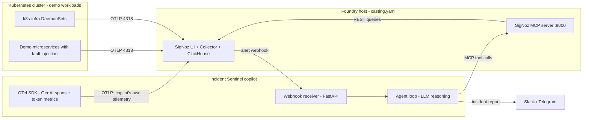

# Architecture — Incident Sentinel

## High-level flow

## Components

### 1. SigNoz via Foundry (`foundry/casting.yaml`)
- Docker Compose flavor on the standalone host
- MCP server enabled in the same casting file (`mcp.spec.enabled: true`, port 8000)
- API key from a service account (Settings → Service Accounts, Admin role)

### 2. Demo workloads (`demo/`)
- 2-3 small services (e.g. `checkout-api` → `payment-svc` → `inventory-svc`) with
  fault injection endpoints: error-rate knob, latency knob, memory-leak simulation
- CronJob/loadgen keeps steady traffic; a `break.sh` script triggers each incident type
- Runs on the existing k8s cluster; exports OTLP/HTTP to the Foundry SigNoz
- k8s-infra chart pointed at the same collector for infra context

### 3. Copilot (`copilot/`)
- **Webhook receiver**: FastAPI endpoint registered as a SigNoz notification channel.
  Receives the alert payload (rule name, labels, threshold breach).
- **Agent loop**: plan → investigate → conclude, bounded to N steps.
  - MCP client (HTTP transport) calling the SigNoz MCP server tools:
    `signoz_get_alert_history`, `signoz_list_services`, `signoz_search_traces`,
    `signoz_get_trace_details`, `signoz_search_logs`, `signoz_query_metrics`,
    `signoz_get_field_values`
  - LLM does hypothesis-driven investigation: each step picks one tool, interprets
    the result, refines the hypothesis
- **Report generator**: structured Slack Block Kit message — summary, timeline,
  root-cause hypothesis with confidence, evidence links (`webUrl` deep links),
  suggested next actions
- **Self-instrumentation** (the differentiator):
  - One trace per incident investigation; spans follow OTel **GenAI semantic
    conventions** (`gen_ai.system`, `gen_ai.request.model`, `gen_ai.usage.input_tokens`,
    `gen_ai.usage.output_tokens`)
  - Custom attributes: `sentinel.step`, `sentinel.tool`, `sentinel.hypothesis`,
    `sentinel.cost.usd`
  - Metrics: `sentinel_tokens_total`, `sentinel_cost_usd_total`,
    `sentinel_investigation_duration`, `sentinel_tool_errors_total`
  - Logs correlated by `trace_id`
  - A cost-budget alert **on the copilot itself** — the watcher is watched

### 4. Dashboards (`dashboards/`)
- **Incident Overview**: alert timeline, error rates per service, latency percentiles
- **Copilot Operations**: token usage/cost per investigation, step latency breakdown,
  tool-call error rate, investigations per day — the Track 02-grade artifact

### 5. kagent packaging (stretch goal only, `copilot/kagent/`)
- `Agent` CRD + `ToolServer` CRD pointing at the SigNoz MCP server
- Same copilot behavior, deployed as a Kubernetes-native agent
- Only attempted after the custom loop is demo-complete (see DECISIONS.md)

## Failure modes handled

- LLM timeout/rate-limit → bounded retries, report degrades to "evidence bundle"
  (raw findings without hypothesis) rather than silence
- MCP tool error → skip-and-note in the report, counted in `sentinel_tool_errors_total`
- Alert storm → dedupe window per rule ID, max concurrent investigations = 2
