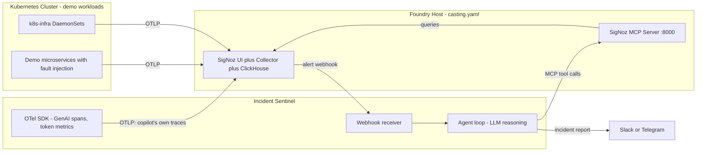

# Agents of SigNoz Hackathon Plan (Jul 20-26, 2026)

## Strategy: one flagship, three-track coverage

One deep project beats three shallow ones. The flagship targets **Track 01 (AI & Agent Observability, MacBook Air)** and by construction produces:
- A **dashboard pack + Query Builder showcase** (Track 02 pivot if needed)
- A complete "observe anything with SigNoz" story (Track 03 fallback)

Final track selection happens at submission time. Rule 8 allows planning/diagrams now; **code only after Jul 20**.

## The Project: "Incident Sentinel" — an SRE Incident Copilot that watches itself

**Problem it solves:** When an alert fires at 2am, an engineer spends 20-40 minutes triaging: which service, which trace, which log, what changed. And when teams adopt AI agents to do this triage, the agent itself becomes a new black box.

**What it does (the loop):**
1. A SigNoz alert fires (error spike / latency / anomaly) and hits the copilot's webhook channel
2. The copilot agent investigates autonomously using **SigNoz MCP tools**: `signoz_get_alert_history`, `signoz_search_traces`, `signoz_get_trace_details`, `signoz_search_logs`, `signoz_query_metrics`, `signoz_list_services`
3. It correlates signals, forms a root-cause hypothesis, and posts a structured incident report to Slack/Telegram with deep links (`webUrl`) back into SigNoz
4. **The twist:** every reasoning step, MCP tool call, LLM request, token count, and cost is itself instrumented with OpenTelemetry GenAI semantic conventions and exported back into the same SigNoz — the copilot debugging your system is debuggable in the same UI

**Why it wins on the 6 judging criteria:**
- Impact: automates real MTTR reduction; every SRE team has this pain
- Creativity: the self-observing agent loop (agent traces land beside the incidents it investigates)
- Technical excellence: clean webhook -> agent -> MCP -> report pipeline, reproducible via Foundry
- Best use of SigNoz: consumes alerts, traces, logs, metrics AND produces dashboards, uses MCP, Query Builder, notification channels — every feature touched
- UX: a Slack report a human actually reads, with one-click deep links
- Presentation: live demo of breaking a service and watching both the incident and the copilot's brain in SigNoz

## Architecture

**Stack decisions:**
- SigNoz deployed with **Foundry** (`casting.yaml` + `casting.yaml.lock` committed — a hard Field Requirement; MCP server enabled in the same file)
- Copilot core: **custom Python agent loop** (FastAPI webhook + MCP client + OTel SDK) — full control over GenAI semconv spans and token/cost attributes
- **kagent as stretch goal** (day 5-6, only if core is done): package the copilot as a kagent `Agent` CRD with the SigNoz MCP `ToolServer`, deployed on the k8s cluster — adds the "Kubernetes-native agent" wow without betting the project on it
- LLM: user's available key (OpenAI/Anthropic/Gemini/Groq) or Ollama fallback — cost tracking demo is richer with a metered API

## Deliverables checklist (mapped to submission form)

- Repo: public GitHub (this project)
  - `casting.yaml` + `casting.yaml.lock` (reproducible SigNoz + MCP)
  - `copilot/` — agent source, fully instrumented
  - `demo/` — fault-injectable demo services + load generator
  - `dashboards/` — exported JSON: "Copilot Operations" (token cost, step latency, tool-call error rate) + "Incident Overview" dashboards
  - `alerts/` — alert rule definitions the demo uses
  - README with architecture, quick start, demo script
- Blog on Dev.to (per Blog Guide: real experience, what broke, 1000+ words, screenshots)
- 2-3 min demo video: break checkout -> alert fires -> Slack report appears -> open SigNoz, show the copilot's own trace with token costs
- AI-assistant usage declared in submission (rule 7)
- Social posts during the week tagging @wemakedevs + SigNoz (side-track swag)

## Timeline (hackathon week)

- **Now - Jul 19 (allowed prep):** finalize this plan, sketch report format, register team, read Foundry + MCP + GenAI semconv docs, publish Early Win blog (separate prize, due Jul 19)
- **Jul 20 (D1):** Foundry-deploy SigNoz + MCP on a host; demo services + k8s-infra sending data; alert rules + webhook channel wired
- **Jul 21-22 (D2-3):** copilot core — webhook receiver, agent loop with SigNoz MCP tools, Slack report; first end-to-end run
- **Jul 23 (D4):** self-instrumentation — GenAI spans, token/cost metrics, trace-correlated logs; "Copilot Operations" dashboard
- **Jul 24 (D5):** polish loop — better prompts, failure modes (LLM timeout, MCP errors), cost-budget alert on the copilot itself; start kagent stretch if ahead
- **Jul 25 (D6):** dashboards export, README, demo video recording, blog draft
- **Jul 26 (D7):** buffer + blog publish + submission form + final social post

## Risks and mitigations

- **Foundry host capacity:** SigNoz via Foundry needs a Docker host with ~4GB free; use the least busy node or a separate VM. Existing Helm SigNoz stays untouched (it was the Early Win artifact)
- **kagent too heavy / delays:** it is a stretch goal; the custom loop is the deliverable
- **LLM flakiness in demo:** record video against a stable run; keep Ollama fallback config
- **Scope creep:** the agent handles 2-3 alert types extremely well rather than everything poorly

## Answers to open questions (from earlier)

- All three prizes: not by splitting effort — one flagship, pivot-ready. If a teammate joins, they can own a genuinely separate Track 02 submission (e.g. the SLO/error-budget dashboard pack) as its own project
- Track 03 meaning: open-ended "observe anything" — our flagship qualifies as fallback
- kagent: applicable and impressive, but stretch-goal layer, not the core bet